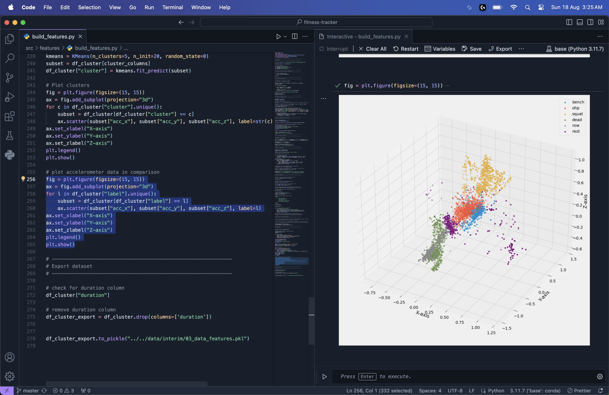
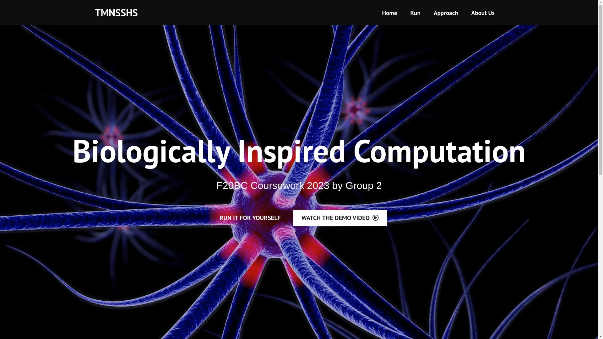

# React Native Apps

This repo contains my Artificial Intelligence and Machine Learning projects in one place for easy access.

## Fitness Tracker

This project performs data mining on exercise data and then implements a custom machine learning algorithm to predict the type of workout being done based on gyroscope and accelerometer readings.

Tools Used: Python, Scikit Learn, Jupyter Notebook, Pandas, Numpy, matplotlib

[Repo Link](https://github.com/MosesDVarghese/fitness-tracker)

### Sample Image

## Neural Network Interface

A fully responsive web interface to set the parameters of an artificial neural network (ANN) and a particle swarm optimization (PSO) training algorithm.

Tools Used: Python, Pandas, Numpy, React

[Repo Link](https://github.com/MosesDVarghese/f20bc_group2_2023-24)

### Sample Image

## Data Mining on Traffic Signs Data

A repository that performs the full data science operations on Traffic Signs data. Everything from data reading, cleaning, to clustering of data, model classification, and evaluation of the best models.

Tools Used: Python, Scikit Learn, Keras, Jupyter Notebook, Pandas, Numpy, matplotlib

[Repo Link](https://github.com/MosesDVarghese/F20DL_Coursework_Group8_2023-24)
